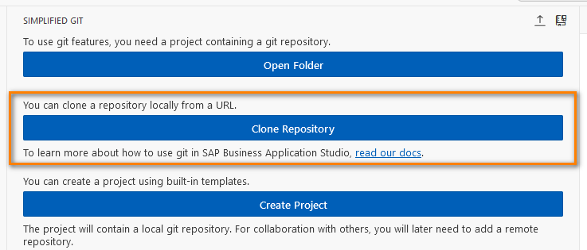
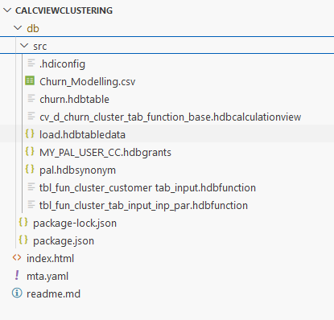
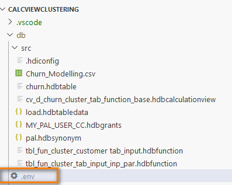
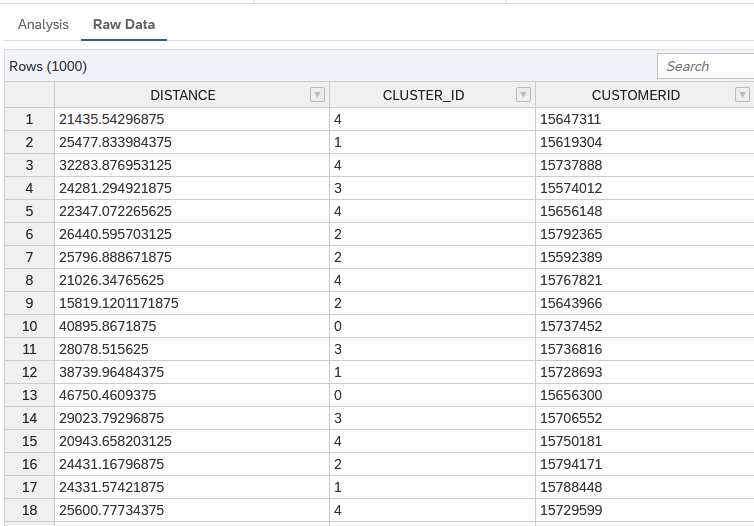
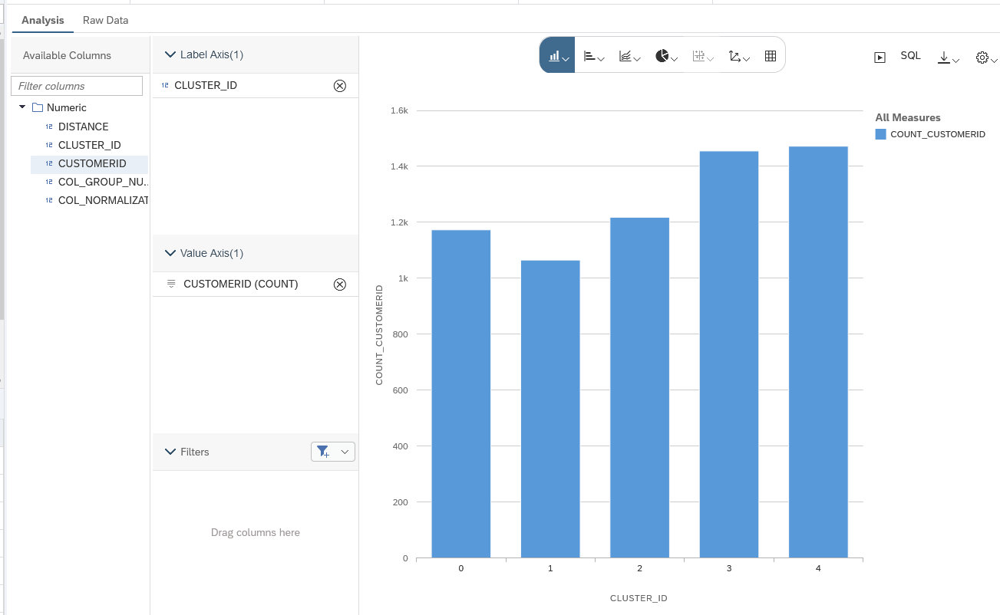
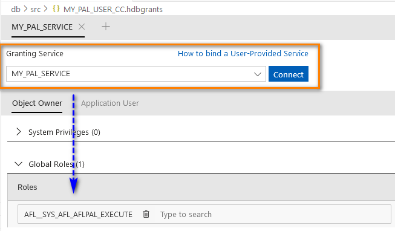

# About this Github Repository

This Github repository contains a SAP HANA database project that illustrates the usage of machine learning logic in Calculation Views. The project can be imported in SAP Business Application Studio. The project contains a table function that implements the K-Means Cluster procedure from PAL (Predictive Analysis Library) and a Calculation View that calls the table functions. This Calculation View can be integrated into stacked Calculation Views allowing to analyze and visualize the resulting cluster analysis.
As this project uses HDI (HANA deployment infrastructure) some preparations for access of the procedures of PAL inside the HDI container are required.

<!-- Start Document Outline -->

* [Prerequisites](#prerequisites)
* [Import project to Business Application Studio](#import-project-to-business-application-studio)
* [Preparation - Binding target container and user-provided service](#preparation---binding-target-container-and-user-provided-service)
	* [Bind HDI target container for deployment](#bind-hdi-target-container-for-deployment)
	* [Create a user-provided service for PAL procedures](#create-a-user-provided-service-for-pal-procedures)
		* [Create technical user](#create-technical-user)
		* [Add user provided service](#add-user-provided-service)
* [Deployment and experimenting with calculation views](#deployment-and-experimenting-with-calculation-views)
* [Additional information](#additional-information)
	* [Understanding the hdbgrant file](#understanding-the-hdbgrant-file)
	* [Usage of PAL procedures using synonyms](#usage-of-pal-procedures-using-synonyms)

<!-- End Document Outline -->

## Prerequisites
This project was developed using Business Application Studio (BAS).
It can be deployed to SAP HANA Cloud. Since BAS supports deployment to XSA also, it should be *in principal* possible to deploy it to an on-premise system. I am happy to hear from you if you experiment with deploying to on-premise systems.

*Note*: The machine learning services of SAP HANA (PAL) are available on SAP BTP free tier or a productive account. 

In your SAP BTP account you need the following services:

- SAP HANA Cloud instance (and corresponding services)
- SAP HANA Schemas & HDI Containers
- Cloud Foundry
- Business Application Studio

The following tutorials and links on SAP developers are a good starting point for setting up your SAP HANA Cloud instance:

- Create BTP free tier account: https://developers.sap.com/tutorials/btp-free-tier-account.html 
- SAP HANA Cloud Free Tier: https://developers.sap.com/tutorials/hana-cloud-mission-trial-2-ft.html 
- Provision an Instance of SAP HANA Cloud: https://developers.sap.com/tutorials/hana-cloud-mission-trial-3.html 


## Import project to Business Application Studio
Open BAS. On the tab "Simplified Git", click on "Clone Repository" and enter the url of this GitHub repository: https://github.com/drabap/CalcViewClustering.



You are asked, if you want to add the repository to your current workspace. Click on "Add to current workspace" or "Open" and return to the Project explorer.


The project should look like this:



Next we bind the relevant services.

## Preparation - Binding target container and user-provided service

Before deploying the project you have to add two services to the project:

- An HDI container as a deployment target
- An user-provided service "MY_PAL_SERVICE" for accessing the PAL procedures of SAP HANA's AFL.

First let us look at creating the HDI container as deployment target.

### Bind HDI target container for deployment

In Explorer open the register "SAP HANA Projects":


Next to "hdi_db" click on bind.


You are asked to login to Cloud Foundry.

Choose "Bind to an HDI container" in the next dialog:


Select "Create a new service instance" in the next prompt :


Enter a unique name for the new container.

The new container is being created:


After succesful creation, a .env file is created:




After successful binding, the register "SAP HANA Projects" should show the binding to the new container:


Note: When creating a SAP HANA project from scratch such an HDI container is automatically created during first deployment.


Next, we have to bind the user-provided service MY_PAL_SERVICE for accessing the PAL procedures.

### Create a user-provided service for PAL procedures
In order to access the machine learning procedures of PAL inside SQLScript design-time objects like table functions or procedures, you have to provide an *external services* with sufficient permissions for the execution of PAL procedure.
First, you create a technical user (see below) and then you add an external services based on this technical user to the HDI container (see below). 


#### Create technical user
First create a technical user called ``MY_PAL_USER_CC``. 
Open a SQL console with user DBADMIN and execute the following statement replacing *\<PASSWORD\>* with a password of your choice:

```sql
CREATE USER MY_PAL_USER_CC PASSWORD <PASSWORD> NO FORCE_FIRST_PASSWORD_CHANGE;
ALTER USER MY_PAL_USER_CC DISABLE PASSWORD LIFETIME;
```

Next grant AFL__SYS_AFL_AFLPAL_EXECUTE to the technical user with admin option:

```sql
GRANT afl__sys_afl_aflpal_execute to MY_PAL_USER_CC WITH ADMIN OPTION
```
Note: During deployment the user MY_PAL_USER_CC will grant this role to the object owner of the HDI container. Thats why you need the *ADMIN OPTION* here.

#### Add user provided service
Again in tab "SAP HANA Projects", click on "add" (plus sign) next to Database Connections:


Select "Creater user-provided service instance". As Service name enter 'MY_PAL_SERVICE'.
In the field "Enter user name" enter the name of the technical database user that you just created:


Dont check the box "Generate hdbgrants file" as the GitHub project supplies already the hdbgrant file "MY_PAL_SERVICE.hdbgrants" that defines which permissions are granted via service MY_PAL_SERVICE.

A new service "cross-container-service-1" appears which is bound to the user-provided service MY_PAL_SERVICE:


## Deployment and experimenting with calculation views
Now you can deploy the SAP HANA project.


After successful deployment, you can open the HDI container:

In the tab "SAP HANA Projects" click on "Open Database Container" next to your project:


Open an SQL Console in the HDI container and paste the following code to execute the table function for the cluster analysis:

```sql
DO
BEGIN

lt_churn = SELECT CUSTOMERID,
	 CREDITSCORE,
	 GEOGRAPHY,
	 GENDER,
	 AGE,
	 TENURE,
	 BALANCE,
	 NUMOFPRODUCTS,
	 HASCRCARD,
	 ISACTIVEMEMBER,
	 ESTIMATEDSALARY
FROM "CHURN";

SELECT * FROM "TBL_FUN_CLUSTER_CUSTOMER_TAB_INPUT"(IT_DATA => :lt_churn);

END;

```
Result:


Open Calculation View base: 
Under the register 'Column Views' open view *cv_d_churn_cluster_tab_function_base* and click "Open Data":
You are prompted to supply input parameters *I_GROUP_NUMBER* and *I_NORMALIZATION*. Keep the default values and click on "Open content":


The cluster logic is executed and the result is shown:


In Analysis tab you can count customer by cluster:


## Additional information

Supplied are some additional information.

### Understanding the hdbgrant file

The file MY_PAL_USER_CC.hdbgrants controls which roles and privileges are granted to the object owner or application user, respectively, by the service MY_PAL_SERVICE through the technical user MY_PAL_USER_CC during deployment. In the tab "object owner" you can see the role 'AFL_SYS_AFL_AFLPAL_EXECUTE':



### Usage of PAL procedures using synonyms

To access procedures (or any other object) outside the HDI container, a reference must be provided via a synonym.
In file pal.hdbsynonym the procedure for K-Means Clustering is provided:


